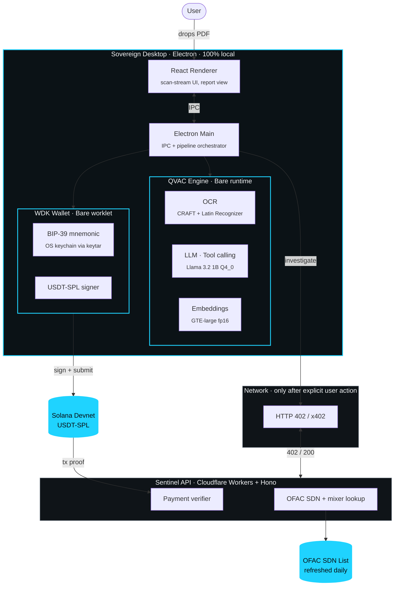
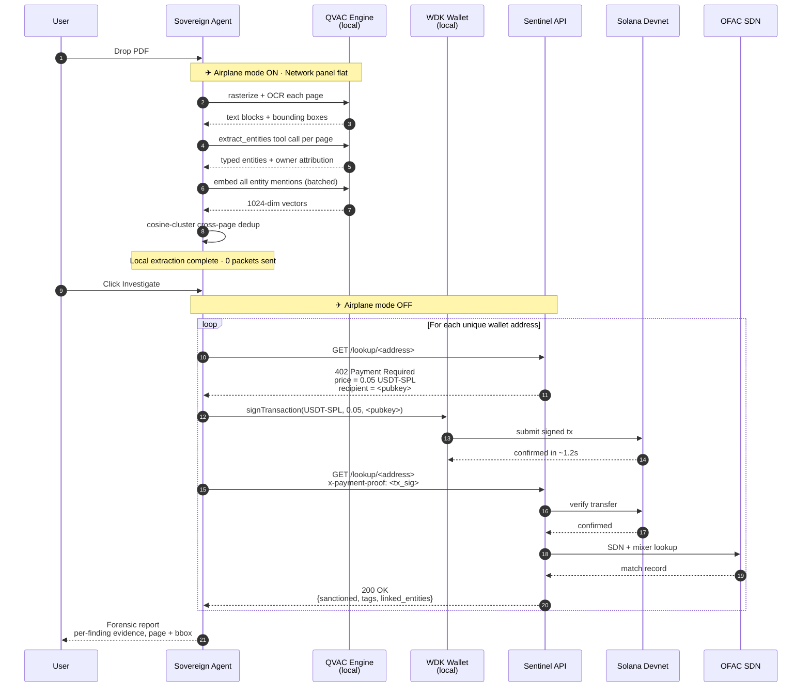

<div align="center">

# Sovereign

### Forensic AI that pays its own way.

A local-first desktop agent that reads sensitive documents, extracts on-chain entities with on-device QVAC inference, and autonomously settles paid intel APIs in **USDT-SPL on Solana** via **HTTP 402** — without the document ever touching the network.

Built for **Colosseum Frontier** + the **Tether QVAC side track**, May 2026.

[](./LICENSE)
[](https://www.npmjs.com/package/@qvac/sdk)
[](https://www.npmjs.com/package/@tetherto/wdk-wallet-solana)
[](https://www.electronjs.org/)
[](https://arena.colosseum.org)

</div>

---

## Demo

<div align="center">

[](https://youtu.be/D1ibS8zL-Xw)

**[▶ Watch the demo on YouTube](https://youtu.be/D1ibS8zL-Xw)**

<sub>3-minute walkthrough · Mac M-series · Solana devnet</sub>

</div>

A sample input document is included so judges can reproduce the demo:
[`Meridian Capital Partners — Project ATLAS Risk Assessment.pdf`](./Meridian%20Capital%20Partners%20—%20Project%20ATLAS%20Risk%20Assessment.pdf).

---

## The problem

A journalist receives a leaked due-diligence file. A lawyer receives a sealed discovery PDF. An auditor reviews an unreleased earnings memo. **Sending any of these to a cloud LLM _is_ the leak.**

Local LLMs solve privacy, but they're blind — they can't query paid intelligence APIs, and they can't transact for themselves. **Sovereign is the first local-first agent with its own non-custodial wallet that can autonomously pay for live external data without leaking the document that prompted the question.**

> The only data that ever leaves the device is a public wallet address — and only after the user explicitly clicks _Investigate_. The document, the prompts, the intermediate reasoning, and the embeddings **never touch the network.**

---

## The three-product trifecta

Sovereign is the only hackathon entry (as of submission) where **all three Tether products are load-bearing on the demo path**.

|  | What it gives the agent | Sovereign uses it for |
|---|---|---|
| **QVAC** | A private brain | OCR + LLM + Embeddings, fully on-device |
| **WDK** | A non-custodial wallet | Autonomous USDT-SPL transaction signing |
| **USDT** | A unit of account | Settlement asset for every paid intel call |

Pull any one of these out and the demo collapses. That's the moat.

---

## System architecture



---

## The x402 handshake, end to end

The full sequence from drag-and-drop to forensic verdict. Every numbered step is implemented in the repo — no hand-waving.



---

## The QVAC pipeline

How a PDF becomes a clustered set of forensic findings without a single byte leaving the device.

```mermaid
flowchart LR
    PDF[(PDF input)]
    PDF --> Raster["pdfjs-dist<br/><sub>page → canvas → buffer</sub>"]

    Raster --> OCR["QVAC OCR<br/><sub>CRAFT detector +<br/>Latin recognizer</sub>"]
    OCR --> Blocks["Text blocks +<br/>4-corner bboxes"]

    Blocks --> Regex["Regex address sweep<br/><sub>EVM · Solana · BTC</sub>"]
    Blocks --> LLM["QVAC LLM<br/><sub>Llama 3.2 1B + Zod tool call</sub>"]
    Regex -->|"candidates"| LLM

    LLM --> Entities["Typed entities<br/><sub>person · org · wallet · amount<br/>+ owner attribution</sub>"]
    Entities --> Filter["Anti-hallucination filter<br/><sub>reject wallets not in regex set</sub>"]

    Filter --> EMB["QVAC Embeddings<br/><sub>GTE-large fp16, batched</sub>"]
    EMB --> Dedup["Cosine cluster<br/><sub>cross-page dedup</sub>"]
    Dedup --> Findings[("Unique findings<br/>ready for x402 lookup")]

    classDef qvac fill:#1FD3FF,stroke:#1FD3FF,color:#07090B,stroke-width:2px;
    classDef step fill:#0F1418,stroke:#8B95A0,color:#F4F6F8;
    classDef io fill:#0B1216,stroke:#1FD3FF,color:#F4F6F8,stroke-width:2px;
    class OCR,LLM,EMB qvac
    class Raster,Blocks,Regex,Entities,Filter,Dedup step
    class PDF,Findings io
```



---

## How we used QVAC (3 modules, deeply integrated)

Depth of QVAC integration is **40% of the judging weight** — we optimized for it. Every QVAC module is load-bearing in the demo path; none are decorative. All three load eagerly through a single Bare-runtime worker via the umbrella [`@qvac/sdk`](https://www.npmjs.com/package/@qvac/sdk) package.

### 1. QVAC LLM with tool calling

| | |
|---|---|
| **Model** | `LLAMA_3_2_1B_INST_Q4_0` (~700 MB) |
| **Backend** | `@qvac/llm-llamacpp`, GPU-accelerated (Metal / Vulkan / CUDA), CPU fallback |
| **Job** | Per-page **forced** `extract_entities` tool call with a Zod-typed schema. Emits typed entities (`person`, `organization`, `wallet_address`, `date`, `amount`, `location`) and **attributes each wallet to its stated on-page owner** ("`0x098B…2f96` → Argonaut Trading Ltd."). |
| **Anti-hallucination** | A regex pre-pass produces a closed set of candidate wallet addresses. The LLM is only permitted to emit `wallet_address` entities whose value appears verbatim in that set — any hallucinated address is rejected. |
| **Config** | `ctx_size: 4096`, `tools: true`, `temp: 0.1`, `gpu_layers: -1` (all layers on GPU when available) |
| **Code** | [`apps/desktop/src/main/qvac/real.ts#L195-L294`](./apps/desktop/src/main/qvac/real.ts#L195-L294) |

> _Pitch line:_ Not OCR'd text → an LLM. **Reasoned structured extraction with owner attribution, end-to-end on-device.**

### 2. QVAC OCR

| | |
|---|---|
| **Models** | `OCR_CRAFT_DETECTOR` (text region detection) + `OCR_LATIN_RECOGNIZER_1` (recognition). ~50 MB combined. |
| **Backend** | `@qvac/ocr-onnx`, runs on Bare runtime |
| **Job** | Streams text blocks with **4-corner polygon bounding boxes** for every rasterized PDF page. PDFs are rasterized with `pdfjs-dist` because QVAC OCR accepts BMP/JPEG/PNG, not PDF. |
| **Used downstream by** | (a) the LLM tool call as the source text per page, (b) the report's evidence-highlighting overlay (each finding is clickable → opens the PDF page and highlights the source bbox). |
| **Code** | [`apps/desktop/src/main/qvac/real.ts#L160-L193`](./apps/desktop/src/main/qvac/real.ts#L160-L193) |

> _Pitch line:_ **Bounding boxes are evidence.** A judge can click any finding in the report and see the exact pixels in the source document — fully reproducible, fully offline.

### 3. QVAC Embeddings

| | |
|---|---|
| **Model** | `GTE_LARGE_FP16` (~600 MB, 1024-dim) |
| **Backend** | `@qvac/embed-llamacpp` |
| **Job** | Semantic deduplication of entity mentions across pages. "Meridian Treasury Wallet" on page 2 and "Meridian's main wallet" on page 7 collapse into **one** finding via cosine similarity clustering. |
| **Throughput** | Batched embedding API — embedding all entities of a 40-page document is sub-second on M-series silicon. |
| **Code** | [`apps/desktop/src/main/qvac/real.ts#L296-L308`](./apps/desktop/src/main/qvac/real.ts#L296-L308) |

> _Pitch line:_ **One wallet referenced three times is one finding, not three.** The report stays clean and the agent never double-pays for the same lookup.

### Mock parity for fast iteration

A deterministic [mock backend](./apps/desktop/src/main/qvac/mock.ts) mirrors the same `QvacEngine` interface so the team iterates UI and pipeline logic on any machine — including Windows + Intel iGPU — without paying the model load cost. One env var swaps:

```bash
SOVEREIGN_QVAC_BACKEND=real   # use @qvac/sdk (Mac M-series recommended)
SOVEREIGN_QVAC_BACKEND=mock   # deterministic stub (default)
```

The engine abstraction is at [`apps/desktop/src/main/qvac/types.ts`](./apps/desktop/src/main/qvac/types.ts) — both backends implement the same `QvacEngine` interface, so the orchestrator code is identical regardless of mode.

---

## How we used WDK + USDT + x402

| Component | Implementation |
|---|---|
| **WDK Solana wallet** | [`@tetherto/wdk-wallet-solana`](https://www.npmjs.com/package/@tetherto/wdk-wallet-solana) v1.0.0-beta.8 pinned (derivation path changed at beta.4). Runs inside a [`@tetherto/pear-wrk-wdk`](https://www.npmjs.com/package/@tetherto/pear-wrk-wdk) Bare worklet so key material is isolated from the main process. |
| **Mnemonic** | 24-word BIP-39 generated via `WDK.getRandomSeedPhrase(24)` on first run. Stored in the OS keychain via `keytar` — never on disk in plaintext. |
| **Derivation** | SLIP-0010 path `m/44'/501'/0'/0'`. |
| **Asset** | USDT-SPL on Solana devnet. Mint pinned to the canonical address. |
| **Settlement** | Per-lookup price 0.05 USDT-SPL. Confirmation in ~1.2s on devnet. |
| **Payment protocol** | HTTP 402 / **x402** handshake. Initial request → 402 with `x-payment-amount` and `x-payment-recipient` headers → agent signs and submits via WDK → re-request with `x-payment-proof: <tx_sig>` → Sentinel verifies on-chain → 200 OK + intel. |

Sentinel-side verification and OFAC lookup logic live in [`apps/sentinel/src/`](./apps/sentinel/src/) — see `x402/`, `solana/`, and `ofac/` subdirectories.

---

## Tech stack

| Layer | Stack |
|---|---|
| Desktop shell | Electron 33 + electron-vite + React 18 + TypeScript 5.6 + Tailwind 3 |
| On-device AI | [`@qvac/sdk`](https://www.npmjs.com/package/@qvac/sdk) v0.9.1 — LLM + OCR + Embeddings |
| Runtime for AI + wallet | Bare ≥ 1.24 (spawned automatically by the SDK) |
| Wallet | [`@tetherto/wdk-wallet-solana`](https://www.npmjs.com/package/@tetherto/wdk-wallet-solana) v1.0.0-beta.8 in a `pear-wrk-wdk` Bare worklet |
| Chain | Solana devnet, USDT-SPL settlement |
| Payment protocol | HTTP 402 / x402 |
| Sentinel API | [Hono](https://hono.dev/) on Cloudflare Workers |
| OFAC data source | US Treasury SDN list, refreshed daily |
| PDF rasterization | `pdfjs-dist` v4 (PDF → canvas → buffer → OCR) |
| Persistence | `better-sqlite3` (history), `keytar` (mnemonic), `electron-store` (settings) |
| Validation | Zod schemas, shared across renderer / main / Worker via `@sovereign/shared` |
| Package manager | pnpm 10 workspaces |

---

## Repository layout

```
sovereign/
├── apps/
│   ├── desktop/         Electron app — Sovereign agent (main + preload + renderer)
│   │   └── src/main/
│   │       ├── qvac/    QVAC engine: real (@qvac/sdk) + mock backends
│   │       ├── wdk/     WDK Solana wallet worklet integration
│   │       ├── pipeline/Pipeline orchestrator
│   │       └── ipc/     Electron IPC handlers
│   ├── sentinel/        Cloudflare Worker — paywalled OFAC + mixer lookup API
│   │   └── src/
│   │       ├── x402/    HTTP 402 / x402 handshake
│   │       ├── solana/  On-chain payment verification
│   │       ├── ofac/    SDN list lookup
│   │       └── intent/  Request routing + intent parsing
│   └── landing/         Public Next.js landing page
├── packages/
│   └── shared/          Zod schemas, IPC contract, constants — shared everywhere
├── scripts/             warmup-models · faucet · deploy helpers
├── docs/
│   ├── architecture.md       System overview
│   ├── architecture-ai.md    QVAC pipeline deep-dive
│   └── architecture-backend.md  Sentinel + x402 deep-dive
├── demo-assets/
└── Meridian Capital Partners — Project ATLAS Risk Assessment.pdf
```

---

## Quickstart

### Prerequisites

- Node.js ≥ 22.17 (see `.nvmrc`)
- pnpm ≥ 10.15 — install with `npm install -g pnpm`
- macOS arm64 (M1+) recommended for the `real` QVAC backend (Metal GPU). Linux + Windows work but fall back to CPU inference.

### Install

```bash
git clone https://github.com/victorjayeoba/sovereign.git
cd sovereign
pnpm install
```

### Run (two terminals)

```bash
# Terminal 1 — Sentinel API on http://localhost:8787
pnpm dev:sentinel
```

```bash
# Terminal 2 — Sovereign desktop app
pnpm dev
```

Both must be running for the autonomous-payment flow to work end-to-end. By default the desktop app boots the **mock QVAC backend** for fast iteration.

### Switch to real QVAC models (~1.35 GB first-run download)

```bash
# macOS / Linux
SOVEREIGN_QVAC_BACKEND=real pnpm dev

# Windows PowerShell
$env:SOVEREIGN_QVAC_BACKEND="real"; pnpm dev
```

First boot pulls the LLM, embeddings, and OCR models from QVAC's Hyperswarm P2P registry into `~/.qvac/models/`. Subsequent boots are instant.

### Pre-cache models on a demo machine

```bash
pnpm tsx scripts/warmup-models.ts
```

---

## 60-second demo flow

| Time | Action | What's happening |
|---|---|---|
| 0:00 | Drop `Meridian Capital Partners — Project ATLAS Risk Assessment.pdf` | Renderer ingests, hands buffer to main |
| 0:01 | **Airplane mode ON** · privacy badge pulses | Network panel goes flat. **Hold this shot.** |
| 0:01–0:08 | Scan-stream renders OCR blocks, entities, dedup clusters live | QVAC OCR → LLM → Embeddings, all on-device |
| 0:08 | Report card materializes with `lookup pending` badges | Local extraction complete · 0 packets sent |
| 0:09 | **Airplane mode OFF** | Agent unlocks the network |
| 0:09–0:11 | Settlement toasts: `0.05 USDT-SPL → confirmed in 1.2s` | x402 handshake + WDK signs + Sentinel verifies |
| 0:11 | Final verdict: **1 OFAC-flagged (Lazarus Group, DPRK)**, **1 Tornado Cash exit**, 2 clean | Total spent: $0.20 USDT in 11 seconds |

---

## Hackathon context

- **Main hackathon:** [Colosseum Frontier](https://arena.colosseum.org) (May 2026)
- **Side track:** Tether QVAC bonus prize pool
- **Deadline:** 2026-05-11 23:59 PDT
- **Judging weights:** QVAC integration depth **40%** · Product value **30%** · Innovation **20%** · Demo quality **10%**

---

## License

MIT — see [`LICENSE`](./LICENSE).

<div align="center">
<sub>Built in Lagos · May 2026</sub>
</div>
